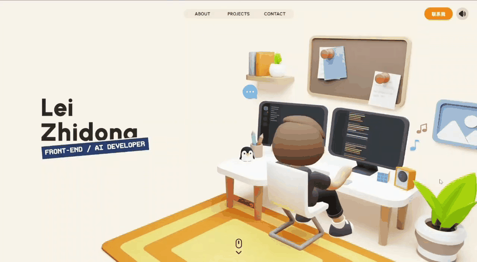
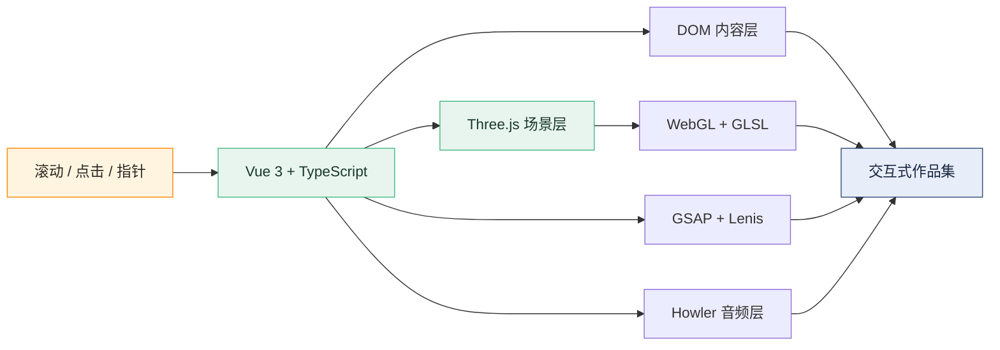

<div align="center">

# Lei Zhidong / 雷智栋

<a href="https://leizhidong.cn">
  
</a>

[](https://leizhidong.cn)
[](https://vuejs.org/)
[](https://threejs.org/)

一个会动、会响、偶尔还会打瞌睡的 3D 个人作品集。

</div>

<p align="center">
  <a href="https://leizhidong.cn">
    
  </a>
</p>

<p align="center"><sub>首页交互录屏已压缩为自动循环 GIF，点击动图进入线上作品集。</sub></p>

## 🎬 这是什么

这是雷智栋的个人 3D 作品集网站，用来展示前端开发、AI 应用和交互视觉方向的项目。

如果普通作品集是一张简历，这里更像一间可以滚动参观的数字工作室：角色在电脑前忙活，场景会跟随滚动切换，按钮有声音，项目也不是老老实实排成一张表。当然，下面还是准备了一张表，毕竟代码可以幽默，文档最好别让人猜。

**在线体验：** [https://leizhidong.cn](https://leizhidong.cn)

## 🎯 体验亮点

| 能力 | 实现 | 体验 |
| --- | --- | --- |
| 3D 场景 | Three.js、GLB、GLSL | 在房间、实验室和联系场景之间连续穿梭 |
| 滚动叙事 | GSAP、Lenis | 页面滚动同步驱动镜头、DOM 和场景转场 |
| 声音反馈 | Howler、Audio Sprite | 环境音、悬浮音与点击音可独立开关 |
| 混合渲染 | Vue 3、TypeScript、WebGL | 3D 空间负责氛围，DOM 负责清晰的信息表达 |
| 内容加载 | 关键资源预载、非首屏资源延迟加载 | 先进入作品集，再按需加载更重的项目媒体 |
| 项目叙事 | 数据驱动内容、深路由 | 每个作品拥有独立页面、图文结构和下一项目导航 |

## 💡 网站创新点

把“看起来很酷”拆成四项可解释的工程能力：

### 3D 数字工作室与角色场景

- **需求：** 让个人介绍拥有空间感和记忆点，而不是另一张静态简历。
- **技术：** Three.js、GLB、GLSL、实时材质与光影。
- **效果：** 角色、房间和物件共同承担叙事，网站成为可探索的数字工作室。

### 滚动驱动的镜头叙事

- **需求：** 让页面滚动、镜头运动和文字转场保持同步。
- **技术：** GSAP Timeline、Lenis、Waypoints、MatchMedia。
- **效果：** 用一条统一时间线编排镜头、DOM 和 3D 场景，形成连续的空间叙事。

### Vue DOM 与 Three.js 混合渲染

- **需求：** 同时解决纯 3D 信息难读和纯 DOM 缺少空间感的问题。
- **技术：** Vue 3、TypeScript、Three.js、WebGL、ProjectedElement。
- **效果：** 3D 负责氛围与纵深，DOM 负责标题、导航和可访问内容。

### 分级资源调度与数据驱动内容

- **需求：** 避免模型、音频和项目媒体阻塞首屏，并降低内容维护成本。
- **技术：** 关键资源清单、加权进度、失败重试、动态导入、`import.meta.glob`、History API、i18n。
- **效果：** 先完成可交互启动，再按需加载内容；项目页由配置生成并可持续扩展。

## ⚙️ 技术栈

<div align="center">
  
</div>



主要依赖：

- **Vue 3 + TypeScript + Vite**：组件、类型系统与构建链路。
- **Three.js + GLSL**：实时 3D、材质、Render Target 和自定义 Shader。
- **GSAP + Lenis**：时间线动画、滚动编排与场景过渡。
- **Howler**：环境音乐、交互音效和 Audio Sprite。
- **Sass**：响应式布局、视觉变量与组件样式。

## 🔧 本地运行

```bash
git clone https://github.com/Leizhidong-creator/leizhidong-myself.git
cd leizhidong-myself
npm install
npm run dev
```

开发服务器默认运行在 [http://localhost:3000](http://localhost:3000)。

| 命令 | 用途 |
| --- | --- |
| `npm run dev` | 启动 Vite 开发服务器 |
| `npm run typecheck` | 执行 Vue / TypeScript 类型检查 |
| `npm test` | 运行资源、加载与部署契约测试 |
| `npm run build` | 类型检查并生成生产构建 |
| `npm run preview` | 本地预览生产构建 |
| `npm run verify` | 依次执行类型检查、测试与生产构建 |

## 📦 目录速览

```text
src/
├─ animations/          # 镜头、路点和场景转场
├─ assets/              # 模型、纹理、声音、视频与作品图片
├─ components/          # 全站通用交互组件
├─ content/projects/    # 项目数据与详情内容
├─ features/            # 首页、项目页与声音模块
├─ i18n/                # 多语言加载与消息
└─ three/               # 场景、相机、渲染器、对象与 Shader

tests/                  # 关键资源、预加载和 GitHub Pages 测试
public/                 # 字体、Meta 图片与静态页面
docs/readme/            # README 展示视频与动图
```

## 🌐 构建与部署

项目推送到 `main` 分支后，由 GitHub Actions 构建 `dist` 并部署到 GitHub Pages。构建流程同时生成 SPA 回退页，项目详情深路由可以直接访问。

```bash
npm run verify
```

提交前运行这条命令，可以一次检查类型、测试和生产构建。

## 🔗 动效来源

README 的动态标题由 [readme-typing-svg](https://github.com/DenverCoder1/readme-typing-svg) 生成，技术图标来自 [Skill Icons](https://github.com/tandpfun/skill-icons)。顶部作品演示视频由本仓库本地托管，不依赖来源不明的动漫素材。

## 📋 License

Copyright (c) 2026 雷智栋。项目代码、个人作品内容、模型、字体、音频和其他素材的使用范围见 [license.md](license.md) 及各自的原始许可说明。

<div align="center">

**认真做交互，顺便让页面有一点自己的脾气。**

[进入 3D 作品集](https://leizhidong.cn) · [查看源码](https://github.com/Leizhidong-creator/leizhidong-myself)

</div>
