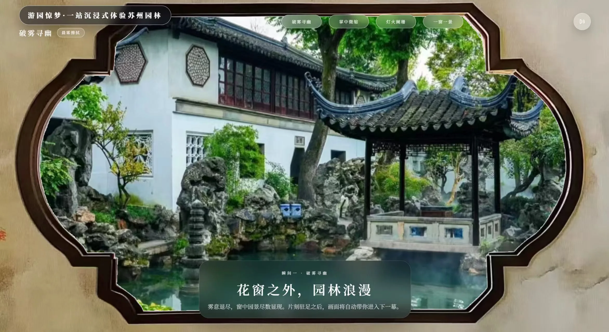
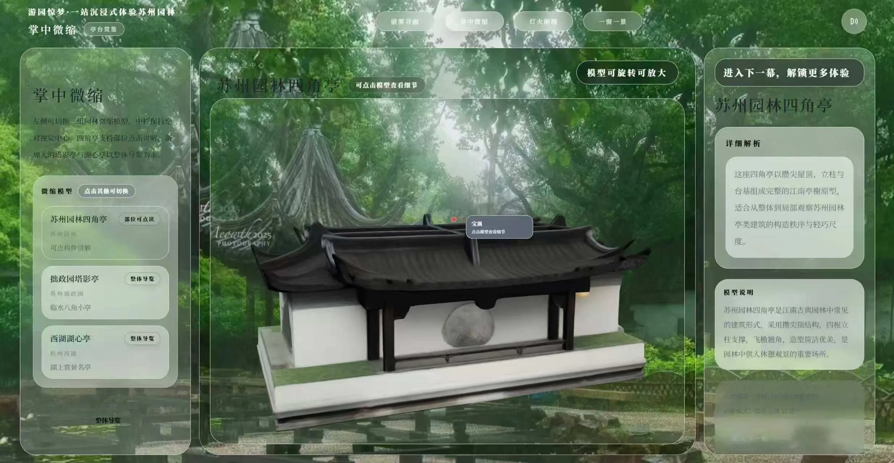
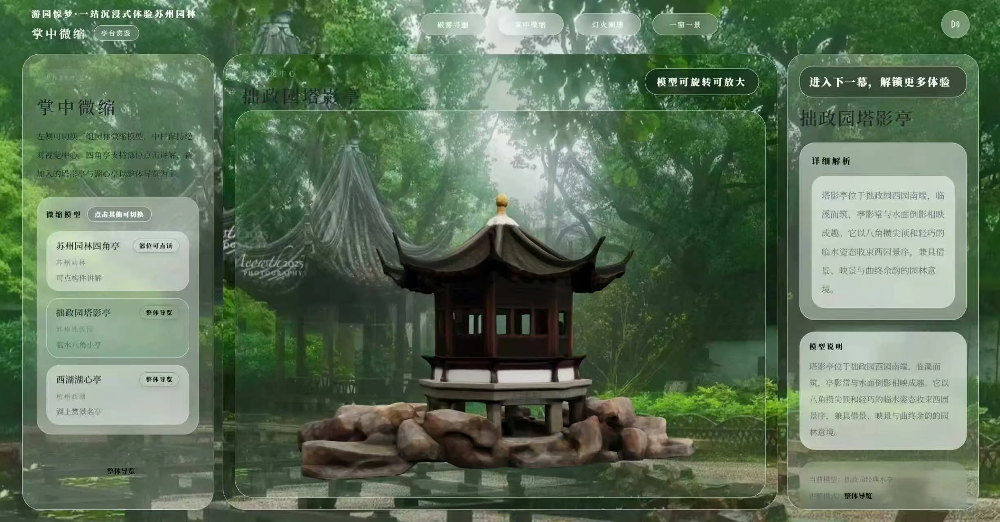

<div align="center">

# 游园惊梦

### Classical Gardens of Suzhou

把苏州园林放进一扇花窗，也把“游园”从观看变成参与。

[](https://vuejs.org/)
[](https://threejs.org/)
[](https://www.typescriptlang.org/)
[](https://vite.dev/)

**抖音 AI 创变者黑客松 · 山西赛区一等奖**  ｜  **游园会之星**

[在线体验](https://hanko-n123-d4gdtdwz71e80944b-1436264436.tcloudbaseapp.com) · [Meta SAM 3D 官方仓库](https://github.com/facebookresearch/sam-3d-objects)

</div>

<p align="center">
  
</p>

<p align="center">
  
  
</p>

## English abstract

**Classical Gardens of Suzhou** is an immersive web experience that reimagines Suzhou's classical gardens as a miniature, interactive digital world. Through flower-window storytelling, AI-assisted 3D assets, and a user-editable garden sandbox, the project turns cultural browsing into a quiet act of exploration and creation.

## 这是什么

传统园林擅长用有限的空间制造无限的想象：一窗可以借景，一墙可以藏景，一条曲廊可以让人在行走中不断遇见新的画面。

《游园惊梦》把这种空间观念转译到浏览器里。它不是一段把用户带到终点的线上导览，也不是把古典建筑平铺在页面上的图集，而是一段以花窗为入口、以微缩 3D 场景为主体、以用户造景为收束的数字园林体验。

项目在 **48 小时** 的黑客松周期内完成，从园林参考素材、AI 生成式 3D 资产，到场景搭建、交互叙事和页面动效，最终获得 **抖音 AI 创变者黑客松山西赛区一等奖**，并获评 **游园会之星**。

## 核心体验

### 花窗不是装饰，而是叙事入口

江南花窗将内容分成一幕一幕。用户先从窗外窥见园林，再进入微缩景观，最后抵达可以亲手调整的自由沙盘。这样的递进式交互保留了传统园林“移步换景”的节奏，也让首屏信息不必一次全部倾泻出来。

### 掌中微缩的 3D 园林

亭台、假山、树影和水面被压缩到一个可以旋转、缩放和凝视的尺度里。Three.js 与 WebGL 负责空间、材质、光影和相机运动，2D DOM 则承接标题、说明、按钮和构件信息，让页面同时拥有场景的纵深与文字的可读性。

### 从观者到造园者

“一窗一景”是项目最重要的参与式设计。用户可以拖拽亭台、假山等园林元素，重新组织一幅属于自己的窗景。园林不再是固定答案，而是一个可以被重新编排的审美空间，真正落到“一千个人心里有一千座园林”。

## 技术实现

```text
2D 参考素材
    ↓
Meta SAM 3D 资产生成
    ↓
材质 / 比例 / 场景坐标适配
    ↓
Three.js + WebGL 场景搭建
    ↓
DOM 与 3D 混合交互
```

### 当前仓库

当前仓库是项目展示站的 Vue 实现，技术栈包括：

- **Vue 3 + TypeScript + Vite**：组织页面、路由和项目内容。
- **Three.js + GLSL**：承载实时 3D 场景、材质和自定义 shader。
- **GSAP + Lenis**：处理场景转场、滚动节奏和细腻的页面运动。
- **Howler**：管理环境声、交互音效和声音开关。

### 竞赛版本

竞赛原型曾使用 React / React Three Fiber 搭建园林体验。README 将下面的 React 技术写作竞赛版本的实现思路，与当前 Vue 展示站区分开来。

## 我是如何优化这条链路的

| 遇到的问题 | 采用的方案 | 带来的变化 |
| --- | --- | --- |
| 异步组件和 3D 资源同时挂载，首屏容易出现空白 | 竞赛版本使用 React `lazy` + `Suspense`，按四幕拆分体验，先渲染轻量的第一幕，再进入 3D Canvas | 首屏不必等待全部场景资源，进入体验的节奏更稳定 |
| 多组 GLB 模型同时请求，网络和解析互相竞争 | 对模型做 `prefetch`，并使用 `useGLTF.preload` 提前建立缓存；非首屏详情媒体移出关键路径 | 把“等待所有资源”改成“先让第一幕可见” |
| 3D 模型能展示，但用户不知道亭台、假山分别是什么 | 使用 `tags.json` 保存构件与模型局部坐标的映射，再结合 `OrbitControls` 和 Drei `Html` 放置点读标签 | 让模型从静态景观变成可解释的空间内容 |
| 高模渲染、转场动画和音频播放同时运行，设备压力集中 | 协同 Three.js / React Three Fiber、GSAP 和音频链路，控制场景复杂度与动画节奏 | 优先保证中端设备上的连续交互，而不是堆叠无意义的面数 |
| 线上文旅常见“看完就走”，缺少参与感 | 用花窗递进叙事承接到“一窗一景”自由沙盘 | 浏览从观看延伸到编辑、分享和再创造 |

> 作品集文档中记录的中端设备帧率和首次可交互时间属于项目阶段的包装估算，未作为本仓库统一的性能基准。这里重点记录的是可复用的优化决策和链路取舍。

## Meta SAM 3D 模型来源

项目使用了 Meta Research 发布的 [SAM 3D Objects](https://github.com/facebookresearch/sam-3d-objects) 作为上游 3D 资产生成能力的参考与来源。

在本项目里，模型并不是“生成完就直接放进页面”。真正花时间的是后续的前端适配：

1. 从园林参考图中筛选适合交互的亭台、假山等对象。
2. 对生成结果进行材质、比例、朝向和场景坐标适配。
3. 将模型组织进微缩园林的空间构图，并处理水面、柔光和阴影的视觉关系。
4. 为模型构件建立空间标签，让用户可以旋转、缩放和点读。
5. 通过预加载、分幕进入和资源拆分，控制生成式 3D 资产对首屏体验的影响。

模型权重、原始代码及其许可证归上游项目所有。使用或再分发相关内容时，请以 [官方仓库](https://github.com/facebookresearch/sam-3d-objects) 当前公布的说明和许可证为准。

## 本地运行

```bash
npm install
npm run dev
```

开发服务器默认运行在 `http://localhost:3000`。

```bash
# 类型检查
npm run typecheck

# 生产构建
npm run build

# 预览生产构建
npm run preview
```

## 目录速览

```text
src/
├─ assets/images/projects/garden-dream/   # 园林项目展示图
├─ assets/models/                         # GLB 场景模型
├─ content/projects/                      # 项目标题、叙事和技术说明
├─ three/                                 # Three.js 场景、材质、shader 与对象
├─ components/                            # 页面级交互组件
└─ assets/styles/                         # 全局视觉样式与动效基础
```

## 项目身份

- **项目**：游园惊梦｜AI 生成式 3D 园林体验
- **英文名**：Classical Gardens of Suzhou
- **角色**：核心开发者，负责 3D 资产适配、前端交互、场景表现与性能链路
- **交付周期**：48 小时黑客松
- **荣誉**：抖音 AI 创变者黑客松山西赛区一等奖、游园会之星

## License

项目代码遵循仓库中的 [license.md](license.md)。第三方模型、字体、音频和其他素材请分别遵循其原始许可证与使用条款。

<div align="center">

**让园林不止被观看，也可以被重新造出来。**

</div>
